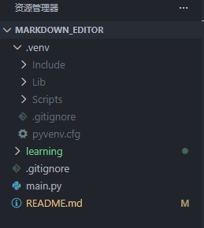
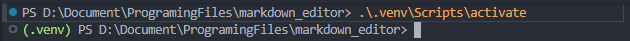
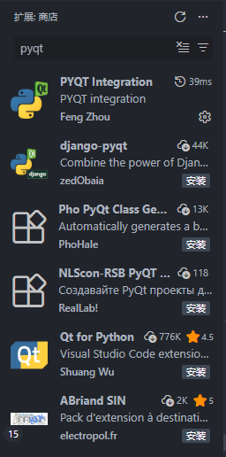
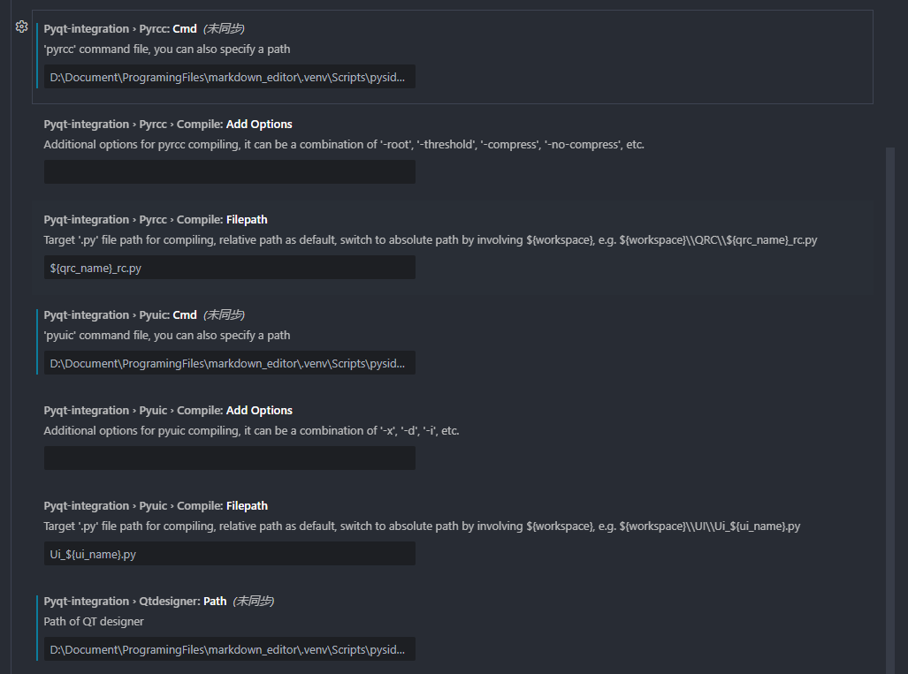

# Markdown编辑器项目（markdown_editor）过程知识

记录一下项目搭建过程中所遇到学到的各种问题与知识。


> 可能会涉及到的五类警示信息
>
> > [!note] 
> >
> > 注意：突出显示用户应考虑的信息，即使只是浏览也应考虑。

> > [!tip]
> >
> > 提示：可选信息，可帮助用户取得更大的成功。

> > [!important]
> >
> > 重要：用户成功所需的关键信息。

> > [!warning]
> >
> > 警告：由于存在潜在风险，需要用户立即关注的关键内容。

> > [!caution]
> >
> > 小心：操作的潜在负面后果。


字体颜色表[^1]：

> [!tip]
> 
> 代码`$\textcolor{GreenYellow}{GreenYellow} $`中，前一个`{}`里的内容为颜色名称，后一个`{}`中内容为需要更改颜色的文字

| 颜色名字 |                   设置代码                   |
| :------: | :------------------------------------------: |
|   黄绿   |   $\textcolor{GreenYellow}{GreenYellow} $    |
|   金黄   |     $\textcolor{Goldenrod}{Goldenrod} $      |
|          |      $\textcolor{Dandelion}{Dandelion}$      |
|          |       $\textcolor{Apricot}{Apricot} $        |
|          |          $\textcolor{Peach}{Peach}$          |
|          |         $\textcolor{Melon}{Melon} $          |
|          |   $\textcolor{YellowOrange}{YellowOrange}$   |
|          |        $\textcolor{Orange}{Orange} $         |
|          |    $\textcolor{BurntOrange}{BurntOrange}$    |
|          |    $\textcolor{Bittersweet}{Bittersweet}$    |
|          |     $\textcolor{RedOrange}{RedOrange} $      |
|          |       $\textcolor{Mahogany}{Mahogany}$       |
|          |        $\textcolor{Maroon}{Maroon} $         |
|          |       $\textcolor{BrickRed}{BrickRed}$       |
|          |           $\textcolor{Red}{Red} $            |
|          |      $\textcolor{OrangeRed}{OrangeRed}$      |
|          |      $\textcolor{RubineRed}{RubineRed}$      |
|          | $\textcolor{WildStrawberry}{WildStrawberry}$ |
|          |         $\textcolor{Salmon}{Salmon}$         |
|          |  $\textcolor{CarnationPink}{CarnationPink}$  |
|          |       $\textcolor{Magenta}{Magenta} $        |
|          |      $\textcolor{VioletRed}{VioletRed}$      |
|          |     $\textcolor{Rhodamine}{Rhodamine} $      |
|          |       $\textcolor{Mulberry}{Mulberry}$       |
|          |     $\textcolor{RedViolet}{RedViolet} $      |
|          |        $\textcolor{Fuchsia}{Fuchsia}$        |
|          |      $\textcolor{Lavender}{Lavender} $       |
|          |        $\textcolor{Thistle}{Thistle}$        |
|          |        $\textcolor{Orchid}{Orchid} $         |
|          |     $\textcolor{DarkOrchid}{DarkOrchid}$     |
|          |        $\textcolor{Purple}{Purple} $         |
|          |           $\textcolor{Plum}{Plum}$           |
|          |        $\textcolor{Violet}{Violet} $         |
|          |    $\textcolor{RoyalPurple}{RoyalPurple}$    |
|          |     $\textcolor{BlueViolet}{BlueViolet}$     |
|          |     $\textcolor{Periwinkle}{Periwinkle}$     |
|          |      $\textcolor{CadetBlue}{CadetBlue}$      |
|          | $\textcolor{CornflowerBlue}{CornflowerBlue}$ |
|          |      $\textcolor{NavyBlue}{NavyBlue} $       |
|          |      $\textcolor{RoyalBlue}{RoyalBlue}$      |
|          |          $\textcolor{Blue}{Blue} $           |
|          |       $\textcolor{Cerulean}{Cerulean}$       |
|          |          $\textcolor{Cyan}{Cyan} $           |
|          |       $\textcolor{SkyBlue}{SkyBlue} $        |
|          |      $\textcolor{Turquoise}{Turquoise}$      |
|          |      $\textcolor{TealBlue}{TealBlue} $       |
|          |     $\textcolor{Aquamarine}{Aquamarine}$     |
|          |     $\textcolor{BlueGreen}{BlueGreen} $      |
|          |        $\textcolor{Emerald}{Emerald}$        |
|          |    $\textcolor{JungleGreen}{JungleGreen}$    |
|          |      $\textcolor{SeaGreen}{SeaGreen} $       |
|          |          $\textcolor{Green}{Green}$          |
|          |    $\textcolor{ForestGreen}{ForestGreen}$    |
|          |     $\textcolor{PineGreen}{PineGreen} $      |
|          |      $\textcolor{LimeGreen}{LimeGreen}$      |
|          |    $\textcolor{YellowGreen}{YellowGreen}$    |
|          |    $\textcolor{SpringGreen}{SpringGreen}$    |
|          |     $\textcolor{OliveGreen}{OliveGreen}$     |
|          |     $\textcolor{RawSienna}{RawSienna} $      |
|          |          $\textcolor{Sepia}{Sepia}$          |
|          |         $\textcolor{Brown}{Brown} $          |
|          |            $\textcolor{Tan}{Tan}$            |
|          |          $\textcolor{Gray}{Gray} $           |
|          |          $\textcolor{Black}{Black}$          |


## 创建及使用虚拟环境


### 创建虚拟环境

在vscode中创建python开发虚拟环境：

```shell
> python -m venv .venv
```

> [!tip]
>
> `python -m`命令用于调用python模块，后面指定的`venv`即是调用python的venv模块，`.venv`是所要创建的虚拟环境文件夹名称

创建好虚拟环境的工作文件夹实例：



### 使用虚拟环境

通过菜单栏创建终端或使用快捷键`Ctrl + Shift + ~`创建终端，通过以下命令进入到虚拟环境：

```shell
> .\.venv\Scripts\activate
```

> [!tip]
>
> `.\.venv`代表进入当前目录下的.venv文件夹，前面不输入`.\`对应进入绝对路径文件夹，会引发报错。

此时，终端命令行前端会有$\textcolor{Green}{(.venv)}$标识，用以区分是否进入了虚拟环境：



### 退出虚拟环境

只需要在终端中输入`deactivate`并回车即可。


## 配置PySide6-Fluent-Widgets框架


### git克隆zhiyiYo/PyQt-Fluent-Widgets远程仓库

在一个空文件夹下打开**git bash**，输入以下代码：

```bash
$ git clone <remote>
```

> [!tip]
>
> <remote>为远程仓库地址，如PySide6-Fluent-Widgets的仓库地址：git@github.com:zhiyiYo/PyQt-Fluent-Widgets.git


### git拉取远程仓库所有分支[^2]

在**git bash**中输入以下代码：

```bash
$ for b in `git branch -r | grep -v -- '->'`; do git branch --track ${b##origin/} $b; done
$ git pull --all
```

> [!tip]
>
> 核心思路是在本地仓库循环创建所有对应远程仓库的分支名称并跟踪分支，最后拉取所有远程分支到本地
>
> 1. 管道符`|`表示前面命令的输出是后面命令的输入
> 2. `for xxx in xxxs; do xxx; done`是shell的for循环语句
> 3. 倒引号``表示里面的是命令
> 4. `git branch -r` 列出远程分支
> 5. grep -v – ‘->’ ，grep查找命令，-v 参数表示not grep ，即查找输入中的不含’->’ 的行
> 6. it branch -r | grep -v – ‘->’ ，合起来就是参看远程分支中除了含有’->’ 的分支
> 7. `$b` 表示远程分支名，例如：origin/dev
> 8. `${b##origin/}` 表示截取远程分支名中origin/后面的内容，例如：dev，以此当做本地分支
> 9. `git branch --track ${b##origin/} $b`，类似于的`git branch dev origin/dev`，新建一个本地分支来跟踪远程的某一分支，`–track`参数是默认的，不加亦可
> 10. `git pull --all`命令从远程仓库拉取所有本地仓库对应远程仓库的分支


### 安装PySide6-Fluent-Widgets及其依赖项

虚拟环境下在终端中输入以下代码：

```shell
> pip install "PySide6-Fluent-Widgets[full]" -i https://pypi.org/simple/
```


### 运行PySide6-Fluent-Widgets示例程序

从`git@github.com:zhiyiYo/PyQt-Fluent-Widgets.git`这个远程仓库克隆PySide6分支，或者参考前面部分拉取所有分支，在本地切换到==PySide6==分支，而后在bash或终端进入到仓库目录下，输入下列代码：

```shell
> python .\examples\gallery\demo.py
```

至此验证本地环境部署了PySide6-Fluent-Widgets


### 配置vscode插件[^3]

在vscode扩展商城安装PYQT Integration



在该扩展设置中做以下设置（路径均为虚拟环境中的路径）：



- Pyqt-integration › Pyrcc: Cmd

```shell
D:\Document\ProgramingFiles\markdown_editor\.venv\Scripts\pyside6-rcc.exe
```

- Pyqt-integration › Pyuic: Cmd

```shell
D:\Document\ProgramingFiles\markdown_editor\.venv\Scripts\pyside6-uic.exe
```

- Pyqt-integration › Qtdesigner: Path

```shell
D:\Document\ProgramingFiles\markdown_editor\.venv\Scripts\pyside6-designer.exe
```


**至此，配置PySide6-Fluent-Widgets框架完成啦！！！**


---

[^1]:参考自CSDN博主「很萌の萌新」的[Typora字体颜色设置的3种方案](https://blog.csdn.net/liulei952413829/article/details/114670380)，版权声明：本文为CSDN博主「很萌の萌新」的原创文章，遵循CC 4.0 BY-SA版权协议，转载请附上原文出处链接及本声明。
[^2]: 参考自CSDN博主「秦时明月之君临天下」的[如何使用Git克隆GitHub仓库的所有分支](https://blog.csdn.net/weixin_41287260/article/details/98987135)，版权声明：本文为CSDN博主「秦时明月之君临天下」的原创文章，遵循CC 4.0 BY-SA版权协议，转载请附上原文出处链接及本声明。
[^3]: 参考自Bilibili UP主的「Python调包侠-Bemake」的[【已完结】PySide6百炼成真，带你系统性入门Qt](https://www.bilibili.com/video/BV1c84y1N7iL?spm_id_from=333.788.videopod.episodes&vd_source=4a58c11cd3c55702078298b2ad395f25&p=2)
