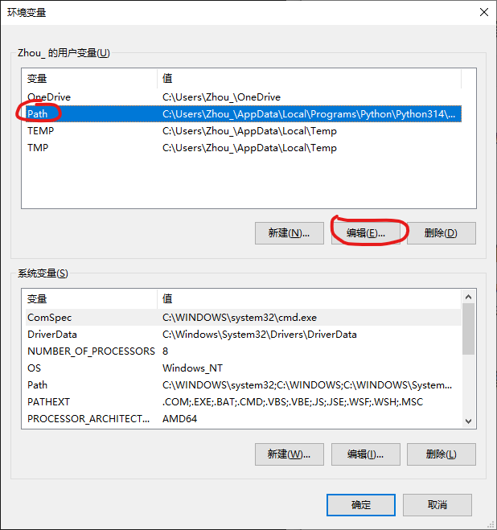
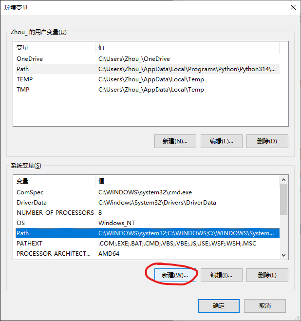
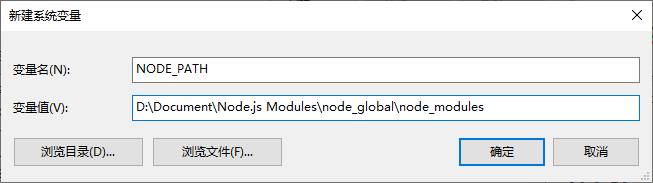

# 杂七杂八的知识


## 本地化部署Excalidraw


### 克隆Excalidraw仓库

在本地克隆Excalidraw仓库：

```bash
$ git clone git@github.com:excalidraw/excalidraw.git
```


### 查看当前本地仓库对应的远程仓库地址

```bash
$ git remote show origin
```

> 此命令会将远程仓库详细信息获取后显示出来，包括远程仓库地址

或者

```bash
$ git remote -v
```


### 下载Node.js

从`https://nodejs.org/zh-cn/download`中下载安装Node.js，注意不要勾选安装必要的组件，这会让Node.js安装时自动下载安装Python、Visual Studio等东西，很慢很不好


### 配置Node.js[^1]

1. 首先查看当前全局配置：

   ```bash
   $ npm config -g ls
   ```

   默认情况下全局的库模块文件下载位置会在`prefix = "C:\\Users\\Zhou_\\AppData\\Roaming\\npm"`中

   

2. 更改默认全局库模块下载位置：

   在Node.js安装文件夹以外选个地方新建两个文件夹`node_global`和`node_cache`，比如在D盘的Document文件夹下创建这两个文件夹，并执行以下命令：

   ```bash
   npm config set prefix "D:\Document\Node.js Modules\node_global"
   npm config set cache "D:\Document\Node.js Modules\node_cache"
   ```

   

3. 更改系统环境变量:

   

   

   

   


### 利用Node.js的npm安装yarn模块

执行以下命令：

```bash
$ npm install -g yarn
```


### 构建Excalidraw本地服务

在本地的excalidraw仓库中打开bash或shell，运行以下命令：

```bash
$ yarn
```

待所有服务构建完成后输入以下命令运行：

```bash
$ yarn start
```


## windows隐藏运行.bat批处理脚本文件[^2]

编辑所需要运行的脚本文件，在开头添加以下内容：

```shell
@echo off
if "%1" == "h" goto begin
mshta vbscript:createobject("wscript.shell").run("""%~nx0"" h",0)(window.close)&&exit
:begin
<要运行的批处理命令>
```


---

[^1]: 引用自[Nodejs安装及全局包位置修改](https://www.jianshu.com/p/dadd0d5354d6)，作者[苦海飘摇](https://www.jianshu.com/u/9ff08a9275ed)
[^2]: 引用自[运行bat脚本文件并隐藏黑色命令行窗口](https://blog.csdn.net/qq_46092061/article/details/139219661)，作者[chaser&upper](https://zsyll.blog.csdn.net/?type=blog)。